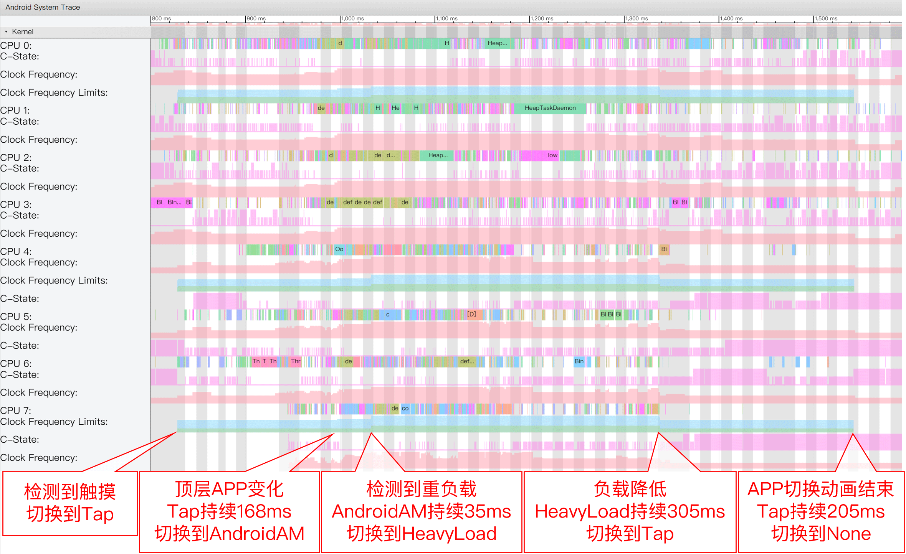
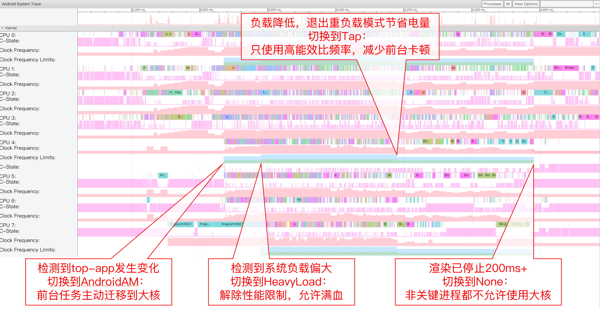
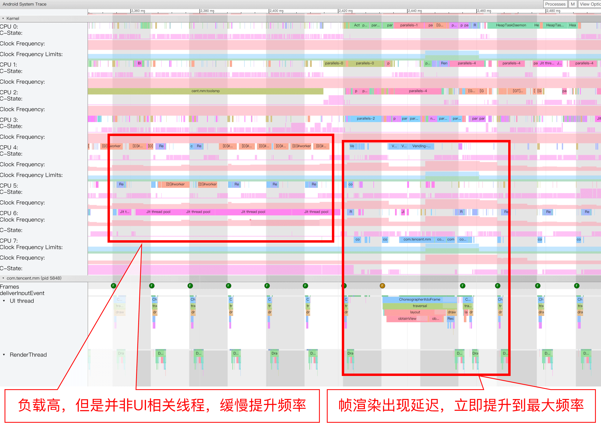
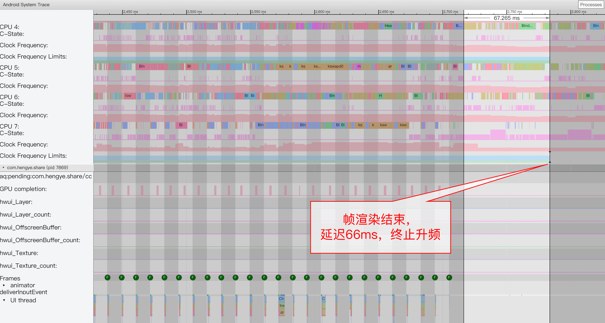
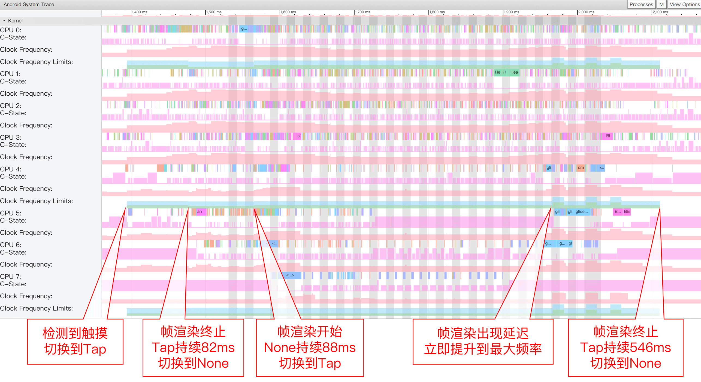
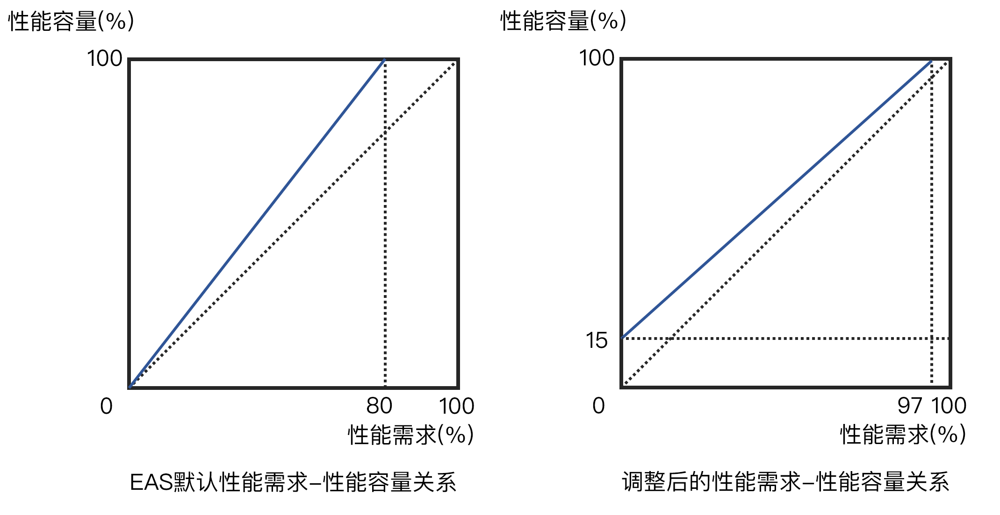
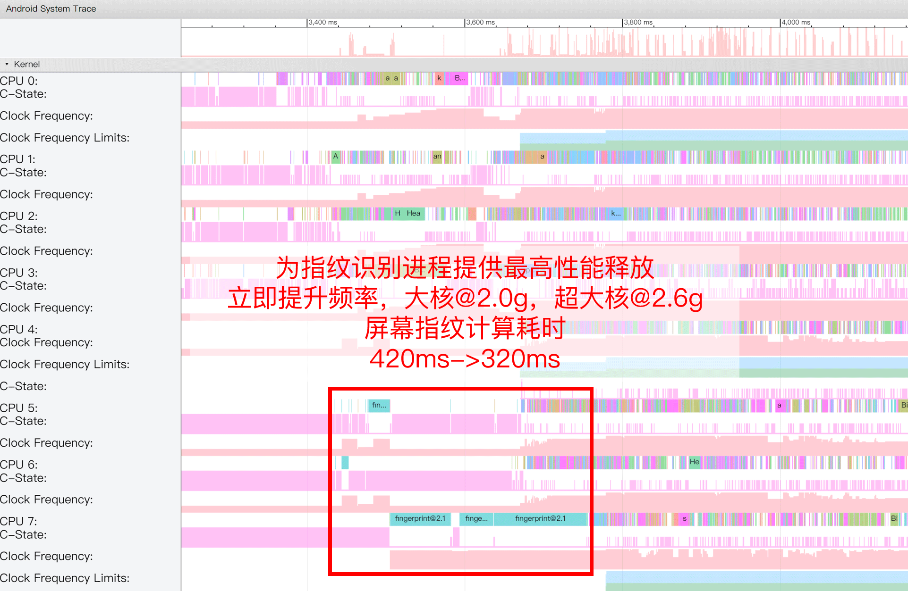

# Uperf

一个Android用户态性能控制器，实现大部分内核态升频功能，并支持更多情景识别。

## 主要功能

- 根据识别的场景类型，动态设定参数控制性能释放，支持所有`sysfs`节点
- 支持动态绑定正在操作的APP的UI相关线程到大核集群
- 从Linux层面读取Android的触摸屏输入信号，识别点击和滑动
- 主动采样系统负载，识别例如APP启动的瞬间重负载
- 监听cpuset分组更新操作，识别正在操作的APP发生切换
- 监听唤醒锁更新操作，识别屏幕是否熄灭
- 监听注入到Surfaceflinger的hook发送的通知，识别渲染开始、滞后、结束
- 支持Android 6.0 - 12
- 支持arm64-v8a
- 支持Magisk方式一键安装，版本不低于20.4+
- 不依赖于Magisk，可以手动方式安装
- 除非SfAnalysis注入失败，大多数情况SELinux可保持`enforcing`
- 不依赖于任何Android应用层框架以及第三方内核
- 为大多数热门硬件平台提供了调参后的配置文件

## 下载

https://github.com/yc9559/uperf/releases

## 安装

### Magisk方式

1. 下载后通过Magisk Manager刷入，Magisk版本不低于18.0
2. 重启后查看`/sdcard/Android/yc/uperf/uperf_log.txt`检查uperf是否正常自启动

### 手动安装

1. 如果你的设备无法安装Magisk，并且已经获取到ROOT权限
2. 下载后手动解压缩，例如解压缩到`/data/uperf`
3. 修改`setup_uperf.sh`，`run_uperf.sh`，`initsvc_uperf.sh`权限为755
4. 执行`setup_uperf.sh`完成安装，检查输出信息是否有报错
5. 执行`run_uperf.sh`启动uperf，检查输出信息是否有报错
6. 打开`/data/cache/injector.log`，检查sfanalysis注入是否成功
7. 如果关联自启动到第三方APP，设置在开机完成后执行`run_uperf.sh`
8. 如果关联自启动到系统启动脚本，插入`sh /data/uperf/initsvc_uperf.sh`
9. 重启后查看`/sdcard/yc/uperf/uperf_log.txt`检查uperf是否正常自启动

### 性能模式切换

#### 修改启动时的默认性能模式

1. 打开`/sdcard/Android/yc/uperf/cur_powermode.txt`
2. 修改`auto`, 其中`auto`为开机后使用的默认性能模式，可选的模式有:
   - `auto`根据正在使用的App进行动态响应
   - `balance`均衡模式，比原厂略流畅的同时略省电
   - `powersave`卡顿模式，保证基本流畅的同时尽可能降低功耗
   - `performance`费电模式，保证费电的同时多一点流畅度
   - `fast`性能模式，相对于均衡模式更加激进
3. 重启

#### 启动完成后切换性能模式

方法1:  
执行`sh /data/powercfg.sh balance`，其中`balance`是想要切换到的性能模式名称。  

方法2:  
安装[Scene](https://www.coolapk.com/apk/com.omarea.vtools)为APP绑定对应的性能模式。  

## 常见问题

Q：是否对待机功耗有负面影响？  
A：Uperf的实现做了不少低功耗的优化，自身运行的功耗开销很低。此外预制配置文件的待机模式中，减少了待机时唤醒的核心数量并使用了保守的升频参数。待机功耗的优化主要靠减少唤醒时长比例，在此基础上Uperf可进一步降低一点待机功耗。  

Q：为什么使用了Uperf还是很费电？  
A：SOC的AP部分功耗主要取决于计算量以及使用的频点。Uperf只能控制性能释放，改进频点的选择从而降低功耗，如果后台APP的计算量很大是无法得到显著的续航延长的。这一问题可以通过Scene工具箱的进程管理器来定位。  

Q：是否需要关闭系统的温度控制？  
A：系统温度控制是一种硬件保护措施，或者用于改善高负载下的用户体验。大多数情况下无需关闭它，如果你遇到性能严重受限的情况，例如运行竞技游戏CPU最大频率限制在1.4Ghz，请提升温控介入的阈值或者关闭系统温度控制。  

Q：Uperf和Scene工具箱是什么关系？  
A：这两个软件独立运作，没有互相依赖。Uperf实现了接口可供Scene工具箱调用，例如性能模式切换以及分APP性能模式。如果不安装Scene工具箱也可以实现性能模式切换，详情见使用方式。  

Q：是否还需要关闭系统的performance boost？  
A：Uperf模块内脚本已经关闭了大部分主流的用户态和内核态升频，如果有非常规的升频需要用户自己关闭。  

Q：我遇到了一些奇怪的系统故障，是怎么回事？  
A：Uperf在大多数平台可以正常工作，在测试阶段收集到了以下可能发生的故障：
- 桌面启动器不响应触摸。这个目前只在MIUI 12遇到，如果遇到了此问题请删除`/data/adb/modules/uperf/enable_sfanalysis`
- 触摸屏报点间断丢失。请检查是否使用了自动跳过之类的APP，特别是支持坐标点击的
- 睡死。用户态应用程序理论上不会影响系统稳定性，请更换为官方内核和ROM

Q：使用Magisk安装时提示`not supported`，这是为什么？  
A：此硬件平台没有预制的配置文件，可能需要自行适配。  

## 详细介绍

这是在[Project WIPE](https://github.com/yc9559/cpufreq-interactive-opt)、[Project WIPE v2](https://github.com/yc9559/wipe-v2)、[Perfd-opt](https://github.com/yc9559/perfd-opt)、[QTI-mem-opt](https://github.com/yc9559/qti-mem-opt)之后的一个新项目。在之前的工作中，往往是基于一个现有的性能控制器做调参，这也意味着最后究竟能做到多好取决于控制器本身的上限。在EAS调度器成为主流之后无法应用WIPE系列的思路，因为EAS的参数自由度实在太少，等到借助了高通Boost框架才实现了更广范围的调整，才有了Perfd-opt。一方面受制于现有的性能控制器的功能限制，一方面还有一部分老设备没有这些新的性能控制器。没有条件就要创造条件，编写了一个安卓全平台的用户态性能控制器。

用户态性能控制通常有着较高的延迟（因为修改sysfs节点消耗相对较多的时间），但是距离实际应用场景很近可以在一些已知的重负载开始之前主动提升性能减少卡顿。一般的工作模式是在系统框架Java层发送Hint，由Native层的服务接收Hint并执行对应的sysfs修改，例如高通CAF Boost Framework、Power-libperfmgr。

与其他用户态性能控制器不同的是，Uperf没有Java层的部分，只有Native层接收时间通知和主动采样，这也就没有了系统框架层面的依赖。因此她不需要重新编译内核，也不需要修改Android框架源码，她也没有几乎硬件平台的限制。她的修改范围涵盖了所有内核态性能控制能够做到的，也就是说不用换掉没啥bug的官方内核，就能使用输入升频（没错，少部分老内核没有这个）、Dynamic Stune Boost、Devfreq Boost这些花式Boost。

下表为几个主要的性能优化方案的功能对比：   
|          功能          | Project WIPE | Perfd-opt(CAF) | libperfmgr | Uperf |
| :--------------------: | :----------: | :------------: | :--------: | :---: |
|    HMP+interactive     |      ✔️       |                |            |   ✔️   |
|     EAS+schedutil      |              |       ✔️        |     ✔️      |   ✔️   |
|       非高通平台       |      ✔️       |                |            |   ✔️   |
|     Android < 8.0      |      ✔️       |                |            |   ✔️   |
|    HMP模型自动调参     |      ✔️       |                |            |   ✔️   |
|   UI线程的CPU亲和性    |              |                |            |   ✔️   |
|        点击升频        |              |                |     ✔️      |   ✔️   |
|      列表滚动升频      |              |       ✔️        |     ✔️      |   ✔️   |
|      APP启动加速       |              |       ✔️        |     ✔️      |   ✔️   |
|      APK安装加速       |              |       ✔️        |            |       |
|        待机优化        |              |                |            |   ✔️   |
|       帧渲染滞后       |              |                |            |   ✔️   |
|     渲染开始、结束     |              |                |            |   ✔️   |
| surfaceflinger复杂合成 |              |                |     ✔️      |       |
|      视频录制情景      |              |                |     ✔️      |       |
|       多性能模式       |      ✔️       |       ✔️        |            |   ✔️   |

### 情景识别

注：v3版本已经修改，此部分不适用
Uperf支持如下几种情景识别：  
- `None`，无Hint的常规状态
- `Touch`，触摸到屏幕切换的Hint
- `Pressed`，长按时切换的的Hint
- `Tap`，在刚触摸到屏幕切换的Hint
- `Swipe`，在屏幕滑动一段距离后切换的Hint
- `HeavyLoad`，在Tap或Swipe检测到重负载后切换，负载降低后回落到Tap
- `SfLag`，给Surfaceflinger的渲染提交出现滞后切换的Hint
- `SfBoost`，Surfaceflinger的渲染提交需要加速切换的Hint
- `Standby`，屏幕熄灭时的Hint，一般滞后20秒(隐藏Hint)
- `SsAnim`，系统动画播放切换的Hint
- `WakeUp`，亮屏解锁切换的Hint


#### 触摸信号识别

本程序采用了跟安卓系统框架获取触摸信号一样的方式，监听位于/dev/input的设备，解析来自触摸屏的报点信息，可以获取到最基本的手指触摸到屏幕和手指离开屏幕的事件。根据一段连续的报点信息可以得到手指滑动的距离以及离开屏幕时末端速度，由此可以推断是点击操作还是滑动操作，以及根据末端速度推算APP滚动的持续时间。

#### 重负载跟踪与限制

因为不在安卓框架层插入Hook无法确切知道APP正在启动，因此本程序在Hint开始后，用主动轮询的方式更新所有CPU核心的使用率和运行频率得到系统整体负载。`系统整体负载 = sum(efficiency(i) * (load_pct(i) / 100) * (freq_mhz(i) / 1000))`，其中`i`为CPU核心ID。如果整体负载高于`heavyLoad`，那么把当前Hint切换到重负载Hint。重负载Hint的响应性能很好但耗电也偏多，本程序会持续监测系统负载，如果整体负载低于阈值，提前结束耗电的重负载Hint。对于负载不是那么高的APP热启动，甚至不会触发重负载，不像高通Boost框架不管负载多少强行拉满CPU持续2s。此外，这样的检测不仅涵盖了APP冷热启动，还涵盖了例如点击进入微信朋友圈这样的短时重负载场景。本功能的能耗开销也是在非常低的0.6ms/100ms（Cortex-A55@1.0g）。下图为微信热启动Hint状态切换与持续时间。



某些的游戏负载确实非常高，系统负载能够非常稳定的持续超过阈值。理论上重负载游戏应该运行在功耗拐点的频率上，保持足够的性能输出的同时才不会发热过大，这与突发重负载的设置初衷矛盾。因此限制了请求进入重负载Hint的请求间隔，在上一次HeavyLoad结束后，负载低于`idleLoad`保持1秒，并且在`requestBurstSlack`这段时间内没有HeavyLoad请求，才能响应新的HeavyLoad，也就过滤了游戏这类持续重负载能耗过高的问题。

#### 正在操作的APP发生切换

基于能够响应上面这些主要的事件，完全可以把非操作时的参数设置的比以前更加保守而不用担心卡顿，但是点亮唤醒是个例外。屏幕下指纹在息屏显示时，按压指纹传感器完成解锁这个操作就算触摸到了屏幕也没有input事件。而点亮屏幕的动画过程往往伴随着大量进程唤醒，保守的参数会造成显著卡顿。本程序通过监测安卓框架的ActivityManager的活动，ActivityManager在正在交互的APP发生变化、解锁屏幕、锁定屏幕时会非常活跃，由此可以推断是否发生了解锁屏幕事件。通过这一监测，还可以实现在APP切换或者启动时，把APP更早的放到大核心，负载迁移延迟可以降低大约100ms。本功能由事件驱动，几乎没有额外的能耗开销。下图为光学屏幕指纹解锁过程。



#### 识别屏幕熄灭

在以往的Project WIPE和Perfd-opt中，很多用户借助Scene工具箱实现熄屏后自动切换到省点模式降低一点待机耗电。处于Native层的Uperf无法像Scene工具箱一样收到系统的熄屏广播，而是监听唤醒锁更新操作来识别屏幕是否熄灭。

#### SfAnalysis

Sfanalysis是一个独立于Uperf的模块，注入到surfaceflinger进行修改，从这个负责Android所有帧渲染提交的进程发出信号，通知Uperf调整性能输出，在观察到卡顿之前就提升性能，真正做到未卜先知，这是所有内核态升频所不能企及的。然而想要她的实现有诸多限制，OEM可以改源码，做内核的可以改内核源码，Uperf为了普适性不能修改源码。如果使用注入方式，surfaceflinger是native进程，使用C++编写，相比system_server这类Java写成的hook位点更少，更不用提不同Android版本的实现还不一样。就算注入成功，由于Android对系统进程设置了很多SELinux规则，防止被注入攻击后取得太多的权限，通知信号也难以发出。绕过了这些限制后，Sfanalysis具有以下功能：  

- hook关键调用，推测并向外部传递渲染开始、渲染提交滞后、渲染结束事件
- 自适应动态刷新率、自适应vsync信号滞后间隔
- 在SELinux的权限范围内，向外部传递信号，因此不需要关闭SELinux才能使用



渲染提交滞后对应的Hint`SfLag`与重负载一样，有调用频率限制避免长时间拉升高频，相关参数暂时没有开放更改。`SfLag`使用可用次数缓冲池控制调用频率，每满400ms间隔可用次数+1，最大到20次。为了避免不必要的频率拉升，只允许从`Tap`、`Swipe`、`Touch`、`Pressed`转移到`SfLag`。SfAnalysis正常工作后在日志以如下方式体现：  
```
[13:03:36][I] SfAnalysis: Surfaceflinger analysis connected
```

#### 渲染结束提前结束Hint

即使有了触摸末端速度推算，由于每个设备的滑动阻尼不同，实际的渲染持续时间也大不相同，套用固定值容易导致电量浪费。在内核态boost可以通过在drm/atomic添加hook实现渲染结束后提前结束Boost，本程序也使用类似的方法，在渲染结束后200-300ms内结束Hint的响应，覆盖全程UI渲染过程的同时减少电量浪费。本程序在Hint开始后，使用主动轮询的方式监控安卓的surfaceflinger活动，几乎所有版本的安卓的渲染提交都经过它，同时能耗开销在非常低的0.4ms/100ms（Cortex-A55@1.0g）。

使用SfAnalysis渲染结束信号之后，提前结束Hint的延迟可以进一步降低到66ms。


在尽可能缩短渲染结束提前结束的滞后的同时，会导致某些UI响应本身存在滞后的场景发生太多卡顿，因为Hint已经提前退出。此类情况大多发生在浏览信息流点击图片切换到全屏显示图片的过程。因此在提前结束Hint的同时，还需要检测是否有滞后的UI响应，在点击的700ms以内如果重新开始渲染会恢复先前的Hint。使用主动轮询的方式监控安卓的surfaceflinger活动，恢复Hint的延时在100ms以上，使用SfAnalysis渲染开始信号之后延迟可以进一步降低到33ms。



### 写入器

写入器基本功能是把目标字符串值写入到`sysfs`节点，除此以外，Uperf还内建了多种写入器实现了其他功能和更加紧凑的参数序列。在切换动作时，Uperf会比对与上一动作参数值的差异，跳过写入重复的值来减少自身功耗开销。Uperf支持的`knob`有如下几种类型：  
- `string`，最基础的写入器。效果等同于`echo "val" > /path`。
- `percluster`，分集群紧凑型写入器。使用配置文件中`platform/clusterCpuId`的CPU序号替换`path`中的`%d`，各个值由逗号分隔，使得按集群做区分的值更加紧凑，改善可读性。
- `percpu`，分核心紧凑型写入器。根据配置文件中`platform/efficiency`的列表长度，生成CPU序号替换`path`中的`%d`，各个值由逗号分隔，使得按CPU核心做区分的值更加紧凑，改善可读性。
- `cpufreq`，`percluster`写入器的变种。大部分功能相同，不同的是写入值=设定值*100000，缩短了频率参数序列的长度，以及带有写入失败重试以处理新的最低频率高于原有的最高频率。
- `cgroup_procs`，Cgroup专用写入器。支持最大4个值，各个值由逗号分隔，设定值为进程名称，Uperf在初始化时会扫描系统所有进程，用匹配到的第一个PID替换它们。一般用于设置系统关键进程到指定的cgroup。由于一个进程的线程可能会动态变化，因此此类写入器会关闭去重。
- `uxaffinity`，UxAffinity写入器。在每次正在操作的APP发生切换时，Uperf都会扫描属于顶层APP的cgroup的所有线程，缓存所有UI相关线程的ID。当设定它为1时，把UI相关线程固定到大核心。当设定它为0时，允许UI相关线程使用全部可用核心。在大多数EAS平台上设置`schedtune.boost > 0`和`schedtune.prefer_idle = 1`即可把任务固定到大核，但是EAS在各个平台的具体实现层次不齐，这个参数组不合适用于所有EAS平台。为了解决这一问题，Uperf主动设置这些关键线程的CPU核心亲和性，适用于所有EAS平台，甚至是HMP平台。

### 预调参

- Uperf模块为大多数热门硬件平台提供了调参后的配置文件，以尽可能发挥Uperf的优势
- HMP平台均衡和卡顿版的`interactive`参数与HMP负载迁移阈值由改进的[Project WIPE v2](https://github.com/yc9559/wipe-v2)提供，费电模式采用固定在功耗拐点的频点提供最稳定持续的性能
- EAS平台的频点选择综合了SOC功耗模型和常见负载的性能需求，由一套固定策略生成
  - 三星、sdm845以及移植的EAS平台，由于缺少关键内核功能采用传统的调参方法，即普通场景不提供过高的性能容量
  - sdm845以后的高通EAS平台，采用调整后性能需求-性能容量模型，见下图



假设系统负载只由单个任务贡献。EAS默认的方式由于`schedutil`总是预留25%性能余量，而SOC的不同频点的能耗比表现不同，越接近最大频率能耗比越低，EAS的默认策略会导致较高负载时最大频率占比偏大。从现实负载变化的规律来看，25%性能余量并不总是够用，负载较低时容易产生大的波动，负载较高时性能需求反而是相对稳定的。从SOC的功耗模型和现实负载变化的规律来看，负载较低时由于波动值的相对百分比较大应该留出更大的性能余量，SOC的低频段一般能耗比差别不大，功耗负面影响不大；负载较高时由于波动值的相对百分比较小应该留出较小的性能余量，SOC的高频段的每个频点之间的能耗比差别比较明显，功耗正面影响较大。

### 外围改进

本模块除了Uperf本体以及SfAnalysis注入，还配合一些外围的改进共同改进用户体验。  
- Uperf启动前其他参数统一化，包括：
  - schedtune置零
  - 使用CFQ调速器，降低多任务运行时前台任务的IO延迟
  - 降低非前台APP的IO带宽占用权重
  - 设置与UI性能密切相关的系统进程到顶层APP的cgroup分组
  - 固定于过渡动画相关的线程到大核
  - 减少大部分传感器线程在大核的唤醒
  - 禁用大多数内核态和用户态boost、热插拔
  - `interactive`和`schedutil`调速器、`core_ctl`、任务调度器外围参数一致化
- 为指纹识别提供最大性能(EAS平台)



## 自定义配置文件

本项目已经为大多数热门硬件平台提供了调参后的Uperf配置文件，但总有一些情况预调参的配置不适用于你的软硬件平台，例如冷门的硬件平台、自定义的内核。此外，也有自定义现有预调参配置文件的需求，例如调高交互时的最低CPU频率、增加GPU频率范围调整。在Uperf设计之初便考虑到了这类需求，开放几乎所有的可调参数，并且在配置文件更改保存后自动重新加载，改善在手机端调试参数的效率。Magisk模块使用的配置文件位于`/sdcard/yc/uperf/cfg_uperf.json`。

### 元信息

```json
"meta": {
    "name": "sdm855/sdm855+ v20200516",
    "author": "yc@coolapk",
    "features": "touch cpuload render standby sfanalysis"
}
```

| 字段名   | 数据类型 | 描述                                           |
| -------- | -------- | ---------------------------------------------- |
| name     | string   | 配置文件的名称                                 |
| author   | string   | 配置文件的作者信息                             |
| features | string   | 配置文件支持的功能列表，目前是保留字段不起作用 |

`name`与`author`在日志以如下方式体现：  
```
[13:03:33][I] CfgMgr: Using [sdm855/sdm855+ v20200516] by [yc@coolapk]
```

### 全局参数

```json
"common": {
    "switchInode": "/sdcard/yc/uperf/cur_powermode",
    "verboseLog": false,
    "uxAffinity": true,
    "stateTransThd": {
        "heavyLoad": 1500,
        "idleLoad": 1000,
        "requestBurstSlack": 3000
    },
    "dispatch": [
        {
            "hint": "None",
            "action": "normal",
            "maxDuration": 0
        },
        {
            "hint": "Tap",
            "action": "interaction",
            "maxDuration": 1500
        },
        ...
    ]
}
```

| 字段名            | 数据类型 | 描述                                                                            |
| ----------------- | -------- | ------------------------------------------------------------------------------- |
| switchInode       | string   | 接收性能模式切换的inode节点                                                     |
| verboseLog        | bool     | 开启详细日志，用于调试Hint切换                                                  |
| uxAffinity        | bool     | 开启UX线程自动设置，固定高优先级的UX线程到大核，并限制低优先级线程的需求响应    |
| heavyLoad         | int      | 进入重负载的系统负载阈值，详见[重负载跟踪与限制](#重负载跟踪与限制)             |
| idleLoad          | int      | 退出重负载的系统负载阈值，详见[重负载跟踪与限制](#重负载跟踪与限制)             |
| requestBurstSlack | int      | 单位毫秒，响应新的重负载请求前的延时，详见[重负载跟踪与限制](#重负载跟踪与限制) |
| hint              | string   | 对应到Uperf内部支持的Hint类型                                                   |
| action            | string   | 绑定的动作名称，可以自定义                                                      |
| maxDuration       | int      | 单位毫秒，动作保持的最大时长                                                    |

在Uperf启动时会读取`switchInode`对应路径的文件获取默认性能模式,在日志以如下方式体现：  
```
[13:03:33][I] CfgMgr: Read default powermode from /sdcard/yc/uperf/cur_powermode
[13:03:33][I] CfgMgr: Powermode "(null)" -> "balance"
```
`switchInode`对应路径的文件，监听新模式名称的写入完成模式切换：  
```shell
echo "powersave" > /sdcard/yc/uperf/cur_powermode
```
在日志以如下方式体现：
``` 
[13:06:45][I] CfgMgr: Powermode "balance" -> "powersave"
```

`dispatch`的绑定关系，在日志以如下方式体现：  
```
[13:03:33][I] CfgMgr: Bind HintNone -> normal
[13:03:33][I] CfgMgr: Bind HintTap -> interaction
[13:03:33][I] CfgMgr: Bind HintSwipe -> interaction
[13:03:33][I] CfgMgr: Bind HintHeavyLoad -> heavyLoad
[13:03:33][I] CfgMgr: Bind HintAndroidAM -> amSwitch
[13:03:33][I] CfgMgr: Bind HintStandby -> standby
[13:03:33][I] CfgMgr: Bind HintSflag -> sfLag
```

`UxAffinity`和`SfAnalysis`这两项功能在日志以如下方式体现：  
```
[13:03:33][I] CfgMgr: UX affinity enabled
...
[13:03:36][I] SfAnalysis: Surfaceflinger analysis connected
```

### 平台信息

```json
"platform": {
    "clusterCpuId": [
        0,
        4,
        7
    ],
    "efficiency": [
        120,
        120,
        120,
        120,
        220,
        220,
        220,
        240
    ],
    "knobs": [
        {
            "name": "cpuFreqMax",
            "path": "/sys/devices/system/cpu/cpu%d/cpufreq/scaling_max_freq",
            "type": "cpufreq",
            "enable": true
        },
        ...
    ]
}
```

| 字段名       | 数据类型    | 描述                                                                  |
| ------------ | ----------- | --------------------------------------------------------------------- |
| clusterCpuId | int list    | 多集群CPU每个集群的首个CPU ID                                         |
| efficiency   | int list    | 每个CPU核心的的相对同频性能，以Cortex-A53@1.0g为100，顺序与CPU ID对应 |
| knobs        | object list | `sysfs`节点列表                                                       |

`knobs`中的每个对象为`knob`，有以下属性：  
| 字段名 | 数据类型 | 描述                                   |
| ------ | -------- | -------------------------------------- |
| name   | string   | `sysfs`节点名称                        |
| path   | string   | `sysfs`节点路径                        |
| type   | string   | `sysfs`节点类型，详见[写入器](#写入器) |
| enable | bool     | 是否启用，方便调试时一键禁用           |

当`enable`字段为false时，在日志以如下方式体现：  
```
[13:03:33][I] CfgMgr: Ignored root/platform/knobs/topCSProcs [Disabled by config file]
```

当`path`字段对应的`sysfs`节点不存在或者不可写入时，在日志以如下方式体现：  
```
[13:03:33][I] CfgMgr: Ignored root/platform/knobs/bigHifreq [Path is not writable]
```

### 性能模式参数

```json
"powermodes": [
    {
        "name": "balance",
        "actions": {
            "interaction": {
                "cpuFreqMax": "18,18,22",
                "cpuFreqMin": "10,10,8",
                "cpuLoadBoost": "0,0,0,0,0,0,0,0",
                "fgCpus": "0-3",
                "topCSProcs": "com.android.systemui,system_server",
                "fgSTProcs": "system_server",
                "ddrBwMax": "6000",
                "ddrBwMin": "2500",
                "uxAffinity": "1"
            },
            ...
        },
        ...
    },
    ...
]
```

| 字段名     | 数据类型 | 描述                                      |
| ---------- | -------- | ----------------------------------------- |
| name       | string   | 可自定义，用于备份调参的多个版本          |
| 动作名称   | string   | 与`common/dispatch`中定义的动作名对应     |
| `knob`名称 | string   | 与`platform/knobs`中定义的`sysfs`节点名称 |
| `knob`值   | string   | 值的格式详见[写入器](#写入器)             |

一个动作应该为所有在`platform/knobs`定义的`knob`设置值。某些时候需要故意跳过某些值的设定，或者复用大部分前一动作的设定值，可以省略部分`knob`设置值，但不能全部。Uperf在加载配置文件时会提示哪些值没有设定会被跳过，在日志以如下方式体现：  
```
[13:03:33][I] CfgMgr: Ignored knobs in action root/powermodes/balance/actions/amSwitch:
[13:03:33][I] CfgMgr: cpuFreqMin llccBwMax llccBwMin ddrBwMax ddrBwMin l3LatBig ddrLatBig 
```

### 示例

利用Uperf为交互和重负载添加关闭UFS节能，以此降低性能关键场景的IO瓶颈问题。  

UFS节能开关的`sysfs`节点路径为`/sys/devices/platform/soc/1d84000.ufshc/clkgate_enable`，接收字符串类型写入，写入"0"为关闭UFS节能，写入"1"为开启UFS节能，把这一节点取名为`ufsClkGateEnable`。在配置文件添加如下文本完成`knob`定义：  
```json
"platform": {
    ...
    "knobs": [
        ...
        {
            "name": "ufsClkGateEnable",
            "path": "/sys/devices/platform/soc/1d84000.ufshc/clkgate_enable",
            "type": "string",
            "enable": true,
            "note": "UFS时钟门开关"
        },
        ...
    ]
}
```

根据[情景识别](#情景识别)中的定义，交互的hint名称为`Tap`和`Swipe`，重负载的hint名称为`HeavyLoad`。   
```json
"dispatch": [
    ...
    {
        "hint": "Tap",
        "action": "interaction",
        "maxDuration": 1500
    },
    {
        "hint": "Swipe",
        "action": "interaction",
        "maxDuration": 3000
    },
    {
        "hint": "HeavyLoad",
        "action": "heavyLoad",
        "maxDuration": 2000
    },
    ...
}
```

根据配置文件内定义的hint与动作的绑定关系，需要给动作`interaction`和`heavyLoad`设置关闭UFS节能，其他动作保持开启UFS节能。在配置文件添加如下文本完成动作定义：     
```json
"powermodes": [
    {
        "name": "balance",
        "actions": {
            "normal": {
                ...
                "ufsClkGateEnable": "1",
                ...
            },
            "interaction": {
                ...
                "ufsClkGateEnable": "0",
                ...
            },
            "heavyLoad": {
                ...
                "ufsClkGateEnable": "0",
                ...
            },
            "amSwitch": {
                ...
            },
            "standby": {
                ...
                "ufsClkGateEnable": "1",
                ...
            },
            "sfLag": {
                ...
            },
        },
    },
    {
        "name": "powersave",
        "actions": {
            "normal": {
                ...
                "ufsClkGateEnable": "1",
                ...
            },
            ...
        },
    },
    ...
]
```

更改配置文件后保存，Uperf会自动创建新的子进程加载新的配置文件，如果新的配置文件格式存在问题，会终止新的子进程保留老的子进程。接下来验证配置文件中设定动作是否能如期执行，对应路径的值是否发生更改。  

## 致谢

感谢以下用户或项目的源码对本项目的帮助：  
- [@AndroidDumps](https://github.com/AndroidDumps)
- [TinyInjector](https://github.com/shunix/TinyInjector)
- [xHook](https://github.com/iqiyi/xHook)
- [@cjybyjk](https://github.com/cjybyjk)
- [@SatySatsZB](https://github.com/SatySatsZB)
- [@osm0sis](https://github.com/osm0sis)
- @YMJ

感谢以下用户的测试反馈和错误定位：  
- @HEX_Stan(coolapk)  
- @僞裝灬(coolapk)  
- @Yoooooo(coolapk)  
- @我愿你安i(coolapk)  
- @鹰雏(coolapk)  
- @yishisanren(coolapk)  
- @asd821385525(coolapk)  
- @倚楼醉听曲(coolapk)  
- @NepPoseidon(coolapk)  
- @寻光丿STLD(coolapk)  
- @比企谷の雪乃(coolapk)  
- @非洲咸鱼(coolapk)  
- @哔哩哔哩弹慕网(coolapk)  
- @我心飞翔的安(coolapk)  
- @浏泽仔(coolapk)  
- @〇MH1031(coolapk)  
- @今天我头条了吗(coolapk)  
- @瓜瓜皮(coolapk)  
- @Universes(coolapk)  
- @Superpinkcat(coolapk)  
- @asto18089(coolapk)  
- @顺其自然的肥肉(coolapk)  
- @酷斗吧(coolapk)  
- @何为永恒(coolapk)  
- @我为啥叫这个(coolapk)  
- @goddard(coolapk)  
- @正果sss(coolapk)  
- @Cowen(coolapk)  
- @瞬光飞翔(coolapk)  
- @kuiot(coolapk)  
- @常凯申将军(coolapk)  
- emptybot08(github)  
- ahzhi(github)  
- Saumer7(github)  

## 捐赠

如果你实在愿意，下面是感谢云讨饭通道(备注写上你的ID和来源平台)：  

