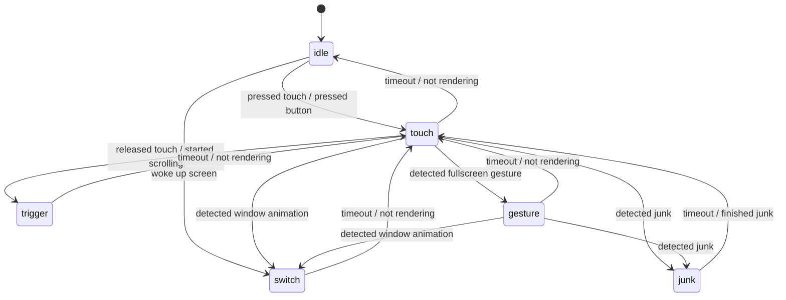

# Uperf v3 配置文件说明

Uperf v3 使用插件化的软件结构设计，每个功能模块均可拥有独立的配置参数空间。

## meta/元信息

| 字段   | 类型   | 描述               |
| ------ | ------ | ------------------ |
| name   | string | 配置文件的名称     |
| author | string | 配置文件的作者信息 |

## modules/模块定义

功能模块的静态参数段，仅在模块实例化时读取一次，用于开关功能、定义模型参数等。

### switcher/动态配置切换器

根据关联的 native 层信号，跳转对应的 hint 状态切换，应用对应的动态参数，并持续指定时长。用户可定义多个性能配置，每个性能配置有各个 hint 的动态参数。动态参数的默认值定义在`/initials`，动态参数的动态值定义在`/presets`。如果在写入`/presets`定义了`powersave`和`balance`两个性能配置，那么`switchInode`文件允许写入`auto`、`powersave`和`balance`，其中`auto`表示启用`内置分APP性能配置切换器`。

注：由于是基础模块，此模块**不可关闭**。

内置分 APP 性能配置切换器的规则样例如下，包名按大小写敏感的全字匹配。行首为`*`表示默认规则，行首为`-`表示熄屏规则，**必须包含默认和熄屏规则**。

```
# 分应用性能模式配置
# Per-app dynamic power mode rule
# '-' means offscreen rule
# '*' means default rule

com.miHoYo.Yuanshen fast
- balance
* balance
```

| 字段         | 类型   | 描述                           |
| ------------ | ------ | ------------------------------ |
| switchInode  | string | 监听手动切换性能模式的文件节点 |
| perapp       | string | 内置分 APP 性能配置文件路径    |
| hintDuration | object | 每个 hint 的最长持续时间       |

#### hintDuration/hint 最长持续时间

各个 hint 使用状态机完成跳转，状态转移图如下：



| 字段    | 类型  | 描述                                               |
| ------- | ----- | -------------------------------------------------- |
| idle    | float | （单位：秒）默认                                   |
| touch   | float | （单位：秒）触摸屏幕/按下按键                      |
| trigger | float | （单位：秒）点击操作离开屏幕/松开按键/滑动操作起始 |
| gesture | float | （单位：秒）全面屏手势                             |
| switch  | float | （单位：秒）应用切换动画/点亮屏幕                  |
| junk    | float | （单位：秒）touch/gesture 中 sfanalysis 检测到掉帧 |

### atrace/数据打点

用于 uperf 程序调试。

| 字段   | 类型 | 描述         |
| ------ | ---- | ------------ |
| enable | bool | 启用数据打点 |

### log/日志级别

用于 uperf 配置文件调试。

| 字段  | 类型   | 描述                                                  |
| ----- | ------ | ----------------------------------------------------- |
| level | string | 日志级别，可用`err`、`warn`、`info`、`debug`、`trace` |

### input/用户输入监听

监听用户触摸屏触摸操作、按键操作、鼠标操作。支持输入设备热插拔。

| 字段             | 类型  | 描述                                             |
| ---------------- | ----- | ------------------------------------------------ |
| enable           | bool  | 启用用户输入监听                                 |
| swipeThd         | float | 单次触摸轨迹百分比长度超过该阈值，判定为滑动操作 |
| gestureThdX      | float | 全面屏手势起始 X 轴百分比位置                    |
| gestureThdY      | float | 全面屏手势起始 Y 轴百分比位置                    |
| gestureDelayTime | float | 暂不使用                                         |
| holdEnterTime    | float | 暂不使用                                         |

### sfanalysis/SurfaceFlinger 信号分析

接收 sfanalysis 模块在 SurfaceFlinger 内部的信号分析结果。检测到掉帧触发 hint，渲染结束提前结束 hint。

| 字段                | 类型  | 描述                                             |
| ------------------- | ----- | ------------------------------------------------ |
| enable              | bool  | 启用 SurfaceFlinger 信号分析                     |
| renderIdleSlackTime | float | （单位：秒）渲染结束保持一段时间，判定为渲染结束 |

### cpu/用户态 CPU 调频

基于能耗模型的用户态 CPU 调频器，使能 HMP/EAS 全平台统一体验。根据功耗模型计算每个频点的每瓦性能，选择最佳的频率限制。

| 字段       | 类型   | 描述                |
| ---------- | ------ | ------------------- |
| enable     | bool   | 启用用户态 CPU 调频 |
| powerModel | object | CPU 能耗模型        |

#### powerModel/能耗模型

仅需一组实测数据即可完成标定。经验模型结合实测数据，保持模型精度并显著减少平台适配工作量。类型为对象列表，与 CPU 集群顺序一致。

注：**典型频点并非调频最大值**，大于典型频点的功耗使用模型外插计算。

| 字段         | 类型  | 描述                                          |
| ------------ | ----- | --------------------------------------------- |
| efficiency   | int   | 单核相对同频性能（以Cortex-A53@1.0Ghz为 100） |
| nr           | int   | 集群内核心数量                                |
| typicalPower | float | （单位：瓦）单核典型功耗                      |
| typicalFreq  | float | （单位：千兆赫）单核典型频点                  |
| sweetFreq    | float | （单位：千兆赫）单核甜点交界频点              |
| plainFreq    | float | （单位：千兆赫）单核线性交界频点              |
| freeFreq     | float | （单位：千兆赫）单核最低功耗频点              |

### sysfs/内核节点写入器

用户态性能控制器的核心功能，为不同场景设置不同的内核参数。此模块高度优化，写入目标值开销极低。

| 字段   | 类型   | 描述               |
| ------ | ------ | ------------------ |
| enable | bool   | 启用内核节点写入器 |
| knob   | object | 内核节点定义       |

#### knob/内核节点定义

按键值对定义：

- 键：内核节点名称
- 值：内核节点文件路径

例子：

```json
"cpusetTa": "/dev/cpuset/top-app/cpus"
```

### sched/识别上下文的任务调度器

在相同的能耗下，改进 QoS 提升用户感知的流畅度。正则匹配进程名和线程名，绑定到指定的 CPU 核心，并设置指定的调度优先级。此模块高度优化，进程扫描和动态规则应用开销极低。

识别上下文的任务调度器定义有如下场景：

- `bg`：进程处于后台
- `fg`：进程处于前台
- `idle`：进程处于顶层可见，默认场景
- `touch`：进程处于顶层可见，交互场景
- `boost`：进程处于顶层可见，重负载场景

| 字段     | 类型   | 描述                       |
| -------- | ------ | -------------------------- |
| enable   | bool   | 启用识别上下文的任务调度器 |
| cpumask  | object | CPU 组定义                 |
| affinity | object | CPU 亲和性类别定义         |
| prio     | object | 调度优先级类别定义         |
| rules    | object | 进程规则                   |

#### cpumask/CPU 组定义

按键值对定义：

- 键：CPU 组名称
- 值：此 CPU 组包含的 CPU 核心 id 列表

例子：

```json
"perf": [4, 5, 6, 7]
```

#### affinity/CPU 亲和性类别定义

按键值对定义：

- 键：CPU 亲和性类别名称
- 值：每个场景绑定到的`cpumask`

例子：

```json
"coop": {
  "bg": "eff",
  "fg": "eff",
  "idle": "norm",
  "touch": "norm",
  "boost": "norm"
}
```

#### prio/调度优先级类别定义

按键值对定义：

- 键：调度优先级类别名称
- 值：每个场景应用的调度优先级，值定义如下

| 数值    | 描述                                                   |
| ------- | ------------------------------------------------------ |
| 0       | 跳过 SCHED 类别设置                                    |
| 1~98    | 设置线程调度类别为`SCHED_FIFO`，数值为实时静态优先级   |
| 100~139 | 设置线程调度类别为`SCHED_NORMAL`，数值为实时静态优先级 |
| -1      | 设置线程调度类别为`SCHED_NORMAL`                       |
| -2      | 设置线程调度类别为`SCHED_BATCH`                        |
| -3      | 设置线程调度类别为`SCHED_IDLE`                         |

例子：

```json
"high": {
  "bg": -3,
  "fg": 110,
  "idle": 104,
  "touch": 102,
  "boost": 100
}
```

#### rules/进程规则

类型为对象列表，与匹配优先级顺序一致。

注：正则匹配规则`/HOME_PACKAGE/`在内部会自动替换为当前系统启动器的包名。

| 字段   | 类型   | 描述                                         |
| ------ | ------ | -------------------------------------------- |
| name   | string | 进程规则名                                   |
| regex  | string | 进程名正则匹配规则，注意不要与 json 语法冲突 |
| pinned | bool   | 始终作为`处于顶层可见的进程`应用规则         |
| rules  | object | 此进程的线程规则                             |

##### rules/线程规则

类型为对象列表，与匹配优先级顺序一致。

注：正则匹配规则`/MAIN_THREAD/`在内部会自动替换为主线程线程名。

| 字段 | 类型   | 描述                                                                    |
| ---- | ------ | ----------------------------------------------------------------------- |
| k    | string | 线程名正则匹配规则，注意不要与 json 语法冲突（abbr: keyword）           |
| ac   | string | 线程的 CPU 亲和性类别，需要在`affinity`预先定义（abbr: affinity class） |
| pc   | string | 线程的调度优先级类别，需要在`prio`预先定义（abbr: priority class）      |

## initials/初始值

功能模块的动态参数段，模块初始化完成后可动态切换，用于调整阈值、模块行为倾向性等。在此段定义的值为该模块参数的默认值。

### cpu/用户态 CPU 调频

基于能耗模型的用户态 CPU 调频器工作流程如下，提供多个可调节参数：

1. 从内核周期性采样 CPU 每个核心的负载
   - CPU 整体存在一定负载时，以`baseSampleTime`周期采样 CPU 频率，提高响应速度
   - CPU 整体进入空载时，以`baseSlackTime`周期采样 CPU 频率，减少轮询开销
2. 计算每个集群的性能负载和性能需求
   - 如果 CPU 集群最大负载增加量大于`predictThd`，则性能需求计算使用预测的负载值
   - 根据性能负载计算性能需求，`demand = load + (1 - load) * (margin + burst)`
   - 与`margin`不同，`burst`非零时即使当前负载较低也能计算到较大的性能需求
3. 计算性能需求对应的工作频点
   - CPU 整体如果存在多个集群，它们共享整个`latencyTime`，表示从性能最低的集群的最低频到性能最高的集群的最高频率的最小延迟
   - 由于离散采样周期的存在，实测 CPU 整体升频最小延迟一般会大于设定的`latencyTime`
   - 能耗代价越大的频点，升频到它的延迟也越大，且低于`sweetFreq`的频点没有额外的升频延迟
4. 限制 CPU 整体的功耗
   - 类似于 Intel 处理器的 PL1 和 PL2 功耗限制，兼顾短期爆发性能需求和长期能效需求
   - 根据能耗模型和每个核心的负载，估计当前周期 CPU 整体的能耗值
   - 如果当前能耗大于`slowLimitPower`，能耗缓冲池余量减少
   - 如果当前能耗小于`slowLimitPower`，能耗缓冲池余量增加，并按照`fastLimitRecoverScale`缩放因子恢复，总量不超过`fastLimitCapacity`
   - 限制 CPU 功耗根据能耗模型选择最优频率限制，在限定功耗下提供最佳整体性能
   - `burst`非零时忽略`fastLimitPower`和`slowLimitPower`限制
5. 引导任务调度器放置任务
   - 启用`guideCap`后，根据能耗模型调节集群性能容量，引导 EAS 任务调度器把任务放置到能效最佳的集群
   - 启用`limitEfficiency`后，低性能集群最大频点能效值不高于高性能集群当前频点的能效值
6. 写入目标 CPU 频率到内核
   - 高效的 CPU 频率写入器，用户态 CPU 调频整体周期运行耗时大约为 0.0005 秒

| 字段                  | 类型  | 描述                                                                                         |
| --------------------- | ----- | -------------------------------------------------------------------------------------------- |
| baseSampleTime        | float | （单位：秒）（0.01~0.5）基础采样周期                                                         |
| baseSlackTime         | float | （单位：秒）（0.01~0.5）闲置采样周期，CPU 整体进入空载时生效                                 |
| latencyTime           | float | （单位：秒）（0.0~10.0）CPU 整体升频最小延迟                                                 |
| slowLimitPower        | float | （单位：瓦）（0.05~999.0）CPU 长期功耗限制                                                   |
| fastLimitPower        | float | （单位：瓦）（0.05~999.0）CPU 短期功耗限制，能耗缓冲池消耗完毕后进入长期功耗限制             |
| fastLimitCapacity     | float | （单位：瓦秒）（0.0~999.0）CPU 短期功耗限制容量，增加时重置余量为限制容量                    |
| fastLimitRecoverScale | float | （0.1~10.0）CPU 短期功耗限制容量恢复缩放因子                                                 |
| predictThd            | float | （0.1~1.0）CPU 集群最大负载增加量大于该阈值，则集群调频使用预测的负载值，并忽略`latencyTime` |
| margin                | float | （0.0~1.0）调频提供的性能余量                                                                |
| burst                 | float | （0.0~1.0）调频提供的额外性能余量，非零时忽略`latencyTime`和功耗限制                         |
| guideCap              | bool  | 启用引导 EAS 任务调度负载转移                                                                |
| limitEfficiency       | bool  | 启用 CPU 整体能效限制                                                                        |

### sysfs/内核节点写入器

按键值对定义：

- 键：内核节点名称
- 值：内核节点文件写入值，支持`string`和`int`类型

例子：

```json
"cpusetTa": "0-7"
```

### sched/识别上下文的任务调度器

| 字段  | 类型   | 描述                                                     |
| ----- | ------ | -------------------------------------------------------- |
| scene | string | 进程处于顶层可见的场景，合法值有`idle`, `touch`, `boost` |

## presets/参数预设

功能模块的参数预设段，在这里定义不同的性能模式，如均衡模式、节能模式。

每组参数预设必须包含`*`, `idle`, `touch`, `trigger`, `gesture`, `junk`, `switch`，如下样例所示。参数预设中子配置名称定义同[动态配置切换器](#switcher/动态配置切换器)，在状态跳转后应用对应模式的动态参数。其中`*`中的参数为该组参数预设的动态参数默认值。

```json
"balance": {
  "*": {
  },
  "idle": {
  },
  "touch": {
  },
  "trigger": {
  },
  "gesture": {
  },
  "junk": {
  },
  "switch": {
  }
}
```

为了提高参数预设的可读性，参数值采用`层叠样式表`的设计方式。以下示例展示参数值`cpu.baseSampleTime`的覆盖关系：

1. 在`/initial/cpu`中定义`baseSampleTime`全局默认值为`0.01`
2. 在`/presets/balance/*`中定义`baseSampleTime`在该参数预设默认值为`0.02`，覆盖全局默认值`0.01`
3. 在`/presets/balance/idle`中定义`baseSampleTime`在`idle`场景值为`0.04`，覆盖该参数预设默认值`0.02`

```
"initials": {
  "cpu": {
    "baseSampleTime": 0.01,
  }
},
"presets": {
  "balance": {
    "*": {
      "cpu.baseSampleTime": 0.02
    },
    "idle": {
      "cpu.baseSampleTime": 0.04
    }
  }
}
```
